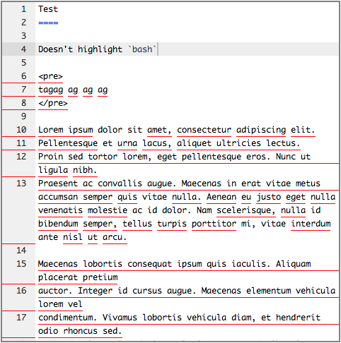

Ace Editor Spellcheck
=====================
Add spellchecking to your Ace editor.

By default it checks US English.

Fix this by modifying the `spellcheck_ace.js` file.

TODOs:

* Only spellcheck changed lines

How to use
----------
Load `spellcheck_ace.js`, after loading jQuery and Typo.js.

You will also need to put the Typo.js dictionaries somwhere you can get at them (an AFF and a DIC file), and modify the JavaScript accordingly. (A few lines at the top.)

* jQuery: http://jquery.com/download/
* Ace: http://d1n0x3qji82z53.cloudfront.net/src-min-noconflict/ace.js
* Typo.js: https://github.com/cfinke/Typo.js/blob/master/typo/typo.js
* US English AFF: https://github.com/cfinke/Typo.js/blob/master/typo/dictionaries/en_US/en_US.aff
* US English DIC: https://github.com/cfinke/Typo.js/blob/master/typo/dictionaries/en_US/en_US.dic

Change the `editor` variable to the id of your Ace editor component.

License
-------

All code in this repository, unless otherwise specified, is hereby
licensed under the MIT Public License:

Copyright (c) 2013 Christopher Swenson.

	Permission is hereby granted, free of charge, to any person
	obtaining a copy of this software and associated documentation
	files (the "Software"), to deal in the Software without
	restriction, including without limitation the rights to use,
	copy, modify, merge, publish, distribute, sublicense, and/or sell
	copies of the Software, and to permit persons to whom the
	Software is furnished to do so, subject to the following
	conditions:

	The above copyright notice and this permission notice shall be
	included in all copies or substantial portions of the Software.

	THE SOFTWARE IS PROVIDED "AS IS", WITHOUT WARRANTY OF ANY KIND,
	EXPRESS OR IMPLIED, INCLUDING BUT NOT LIMITED TO THE WARRANTIES
	OF MERCHANTABILITY, FITNESS FOR A PARTICULAR PURPOSE AND
	NONINFRINGEMENT. IN NO EVENT SHALL THE AUTHORS OR COPYRIGHT
	HOLDERS BE LIABLE FOR ANY CLAIM, DAMAGES OR OTHER LIABILITY,
	WHETHER IN AN ACTION OF CONTRACT, TORT OR OTHERWISE, ARISING
	FROM, OUT OF OR IN CONNECTION WITH THE SOFTWARE OR THE USE OR
	OTHER DEALINGS IN THE SOFTWARE.